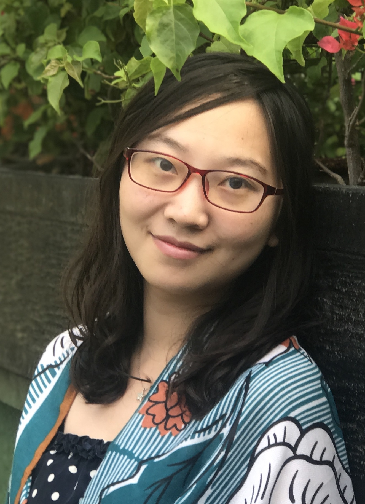

###             

​         **Huiyan Wang (王慧妍)**

​          **Ph.D. student, SPAR Group, Nanjing University (2015~now)**

​          **Email:** cocowhy1013 *at* gmail *dot* com

​          **Address:** Room 813, Building of Computer Science and Technology, 

​                            Nanjing University (Xianlin Campus)

##### <table><tr><td bgcolor=LightSalmon> [**[Bio](#BriefBio)**] [**[Research Interests](#researchinterests)**] [**[Publications](#publications)**] [**[Honors & Awards](#honorsandawards)**] [**[Academic Services](#academic)**] [**[Teaching Experiences](#teaching)**] [**[Hobbies](#hobbies)**] </td></tr></table>

#### *News:*

  ***<u>Our paper has been accepted by ICSE2020. Congratulations!</u>***

  ***<u>Our paper has been accepted by JSS2020. Congratulations!</u>***

#### <table><tr><td bgcolor=PowderBlue>Bio</td></tr></table>

I was born in Taizhou, Jiangsu, China in 1993. I received my Bachelor degree in computer science from [Nanjing University](https://www.nju.edu.cn), Jiangsu, China in July 2015. Since September of 2015, I began to pursue my Ph.D. degree for software engineering under the supervision of associate researcher [Jingwei Xu](http://ics.nju.edu.cn/people/jingweixu/) and [Prof. Chang Xu](https://cs.nju.edu.cn/changxu/), at the [Institute of Computer Science (ICS)](http://ics.nju.edu.cn), [State Key Laboratory for Novel Software Technology](https://keysoftlab.nju.edu.cn), [Department of Computer Science and Technology](https://cs.nju.edu.cn), Nanjing University. I am also a member of [System & Program Analysis Research Group (SPAR group)](http://ics.nju.edu.cn/spar/) at ICS.

#### <table><tr><td bgcolor=PowderBlue>**Research Interests**</td></tr></table>

My research interests include intelligent software quality assurance, context management, software analyses and testing.

#### <table><tr><td bgcolor=PowderBlue>Publications (chronological order)</td></tr></table> 

###### **Journal**

- [JSS2020]Yicheng Huang, [Chang Xu](https://cs.nju.edu.cn/changxu/), [Yanyan Jiang](http://ics.nju.edu.cn/%7Ejyy/), **Huiyan Wang**, and Da Li. WARDER: Towards Effective Spreadsheet Defect Detection by Validity-based Cell Cluster Refinements. *The Journal of Systems and Software (JSS)*, Vol. 167, Article 110615, pp. 1-19, Sep 2020, to appear. [[pdf](./publications/JSS_2020.pdf)][CCF-B]
- [JCS2020]**Huiyan Wang**, [Jingwei Xu](http://ics.nju.edu.cn/people/jingweixu/), and [Chang Xu](https://cs.nju.edu.cn/changxu/). Survey on Runtime Input Validation for Context-aware Adaptive Software (环境感知自适应软件的运行时输入验证技术综述). *Journal of Computer Science (计算机科学)*, Jun 2020, to appear.[[pdf](./publications/JCS_2020.pdf)][中文CCF-B]
- [TSE2020]**Huiyan Wang**, [Chang Xu](https://cs.nju.edu.cn/changxu/), Bingying Guo, [Xiaoxing Ma](http://ics.nju.edu.cn/people/xiaoxingma/), and Jian Lu, “Generic Adaptive Scheduling for Efficient Context Inconsistency Detection”, *IEEE Transactions on Software Engineering*, to appear.[[pdf](./publications/TSE_2020.pdf)][CCF-A]

###### **Conference**

- [ICSE2020]**Huiyan Wang**, [Jingwei Xu](http://ics.nju.edu.cn/people/jingweixu/), [Chang Xu](https://cs.nju.edu.cn/changxu/), [Xiaoxing Ma](http://ics.nju.edu.cn/people/xiaoxingma/), and Jian Lu, “DISSECTOR: Input Validation for Deep Learning Applications by Crossing-layer Dissection”, in *Proceedings of the 42nd ACM/IEEE International Conference on Software Engineering (ICSE)*, to appear, 2020.(acceptance rate: 20.9%)[[pdf](./publications/ICSE_2020.pdf)][CCF-A]
- [ASE2019]Da Li, **Huiyan Wang**, [Chang Xu](https://cs.nju.edu.cn/changxu/), Ruiqing Zhang, [Shing-Chi Cheung](http://home.cse.ust.hk/~scc/), and [Xiaoxing Ma](http://ics.nju.edu.cn/people/xiaoxingma/), “SGUARD: A Feature-based Clustering Tool for Effective Spreadsheet Defect Detection”, in *Proceedings of the 34th IEEE/ACM International Conference on Automated Software Engineering (ASE Tool Demo)*, 1142–1145, 2019.(acceptance rate: 53.7%)[[pdf](./publications/ASE_2019-demo.pdf)][CCF-A]
- [APSEC2019]Ziqi Chen, **Huiyan Wang**, [Chang Xu](https://cs.nju.edu.cn/changxu/), [Xiaoxing Ma](http://ics.nju.edu.cn/people/xiaoxingma/), and [Chun Cao](https://ccao.cc/en/), “Vision: Evaluating Scenario Suitableness for DNN Models by Mirror Synthesis”, in *Proceedings of the 26th Asia-Pacific Software Engineering Conference (APSEC)*, 78–85, 2019.(acceptance rate: 34.7%)[[pdf](./publications/APSEC_2019.pdf)][CCF-C]
- [QRS2019]Da Li, **Huiyan Wang**, [Chang Xu](https://cs.nju.edu.cn/changxu/), Fengmin Shi, [Xiaoxing Ma](http://ics.nju.edu.cn/people/xiaoxingma/), and Jian Lu, “WARDER: Refining Cell Clustering for Effective Spreadsheet Defect Detection via Validity Properties”, in *2019 IEEE 19th International Conference on Software Quality, Reliability and Security (QRS)*, 139–150, 2019.[[pdf](./publications/QRS_2019.pdf)][CCF-C]
- [QRS2018]Yi Qin, **Huiyan Wang**, [Chang Xu](https://cs.nju.edu.cn/changxu/), [Xiaoxing Ma](http://ics.nju.edu.cn/people/xiaoxingma/), and Jian Lu, “SynEva: Evaluating ML Programs by Mirror Program Synthesis”, in *2018 IEEE International Conference on Software Quality, Reliability and Security (QRS)*, 171–182, 2018.(acceptance rate: 22.3%)[[pdf](./publications/QRS_2018.pdf)][CCF-C]
- [ICSME2017]Bingying Guo, **Huiyan Wang**, [Chang Xu](https://cs.nju.edu.cn/changxu/), and Jian Lu, “GEAS: Generic Adaptive Scheduling for High-efficiency Context Inconsistency Detection”, in *2017 IEEE International Conference on Software Maintenance and Evolution (ICSME)*, 137–147, 2017.(acceptance rate: 27.8%)[[pdf](./publications/ICSME_2017.pdf)]-[[slides](./publications/ICSME_2017_slides.pdf)][CCF-B]
- [QRS2016]**Huiyan Wang**, [Chang Xu](https://cs.nju.edu.cn/changxu/), Jun Sui, and Jian Lu, “How effective is branch-based combinatorial testing? An exploratory study”, in *Proceedings of the 2016 IEEE International Conference on Software Quality, Reliability and Security (QRS2016)*, 41–52, 2016.(acceptance rate: 29.1%)[[pdf](./publications/QRS_2016.pdf)][CCF-C]

#### <table><tr><td bgcolor=PowderBlue>Honors and Awards</td></tr></table>

- Artificial Intelligence Scolarship 人工智能奖学金 (Nanjing University, 2019)
- Tung OOCL Scholarship 董氏东方奖学金 (Nanjing University, 2018)
- Outstanding Graduate of Nanjing University (Nanjing University, 2015)

#### <table><tr><td bgcolor=PowderBlue>Academic Services</td></tr></table>

- Subreviewer: TheWebConf 2020, ASONAM 2019

#### <table><tr><td bgcolor=PowderBlue>Teaching Experiences</td></tr></table>

- TA for Guidance to Software Engineering Research (2018 Fall)
- TA for Principle and Techniques of Compilers (2017 Spring)
- TA for Guidance to Software Engineering Research (2016 Fall)
- TA for Principle and Techniques of Compilers (2016 Spring)
- TA for Guidance to Software Engineering Research (2015 Fall)

#### <table><tr><td bgcolor=PowderBlue>Hobbies</td></tr></table>

I love travelling and taking photos. Also, I quite enjoy watching comedy episodes, and I am a big fan of Friends, TBBT, and Modern Family. Welcome to chat with me about anything.

----

Last updated by Huiyan on 2020/06/10.

